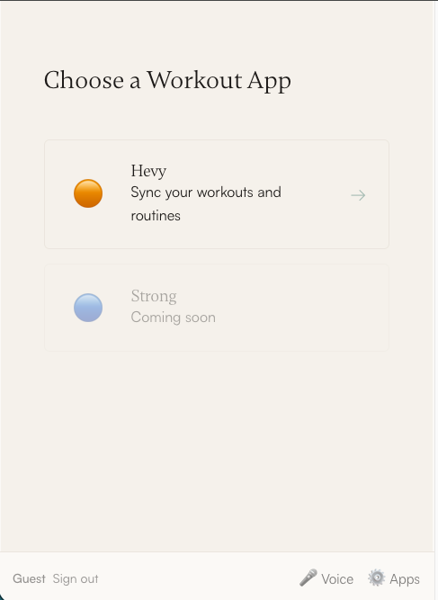
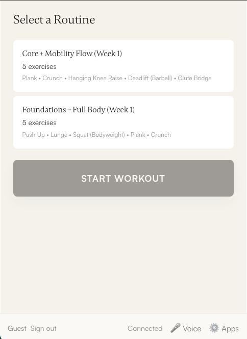
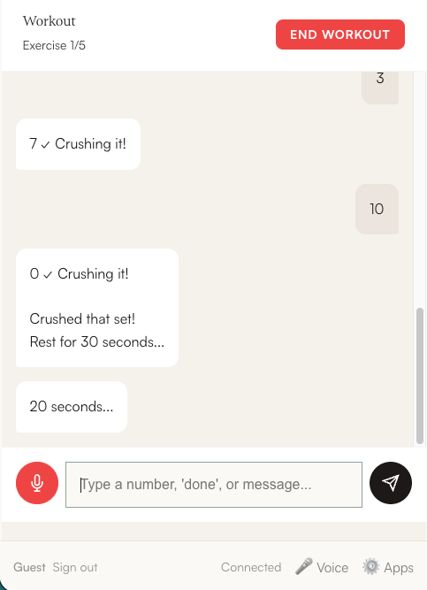
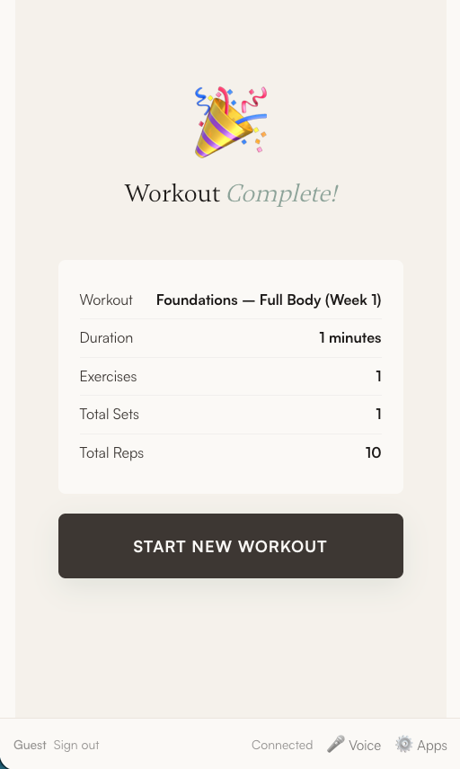
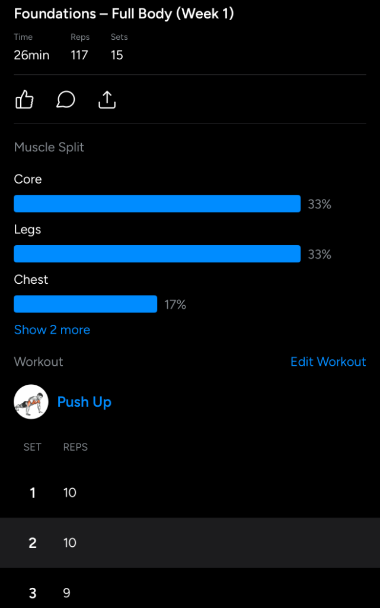

# AI Workout Companion 🏋️

An AI-powered workout companion that integrates with the Hevy fitness app to guide you through your workouts with voice interaction and real-time feedback.

## Screenshots

<p align="center">
  
  
  
  
  
</p>

### Synced to Hevy

<p align="center">
  
</p>

## Recommended Setup

1. **Install [Hevy](https://hevy.com)** - Get the Pro lifetime subscription for API access
2. **Use [ChatGPT](https://chat.openai.com) with [Hevy GPT](https://chatgpt.com/g/g-FI3v2GJpq-hevy-app-assistant)** - Build personalized routines with AI
3. **Use AI Workout Companion** - Log and follow workouts in real-time with voice assist

## Features

- **🎙️ Voice Interaction** - Speak naturally to log reps, skip exercises, or get guidance
- **📱 Hevy Integration** - Syncs your routines and logs workouts directly to Hevy
- **⏱️ Timed Exercise Support** - Automatic countdowns for planks, stretches, and other timed exercises
- **💬 Chat Interface** - Type or speak to interact with your AI coach
- **🔊 Voice Announcements** - Customizable voice settings with adjustable pitch, rate, and volume
- **🗣️ Custom Voice Commands** - Add your own phonetic alternatives for misheard words
- **📊 Workout Summary** - View your completed workout stats before syncing

## Tech Stack

- **Backend**: .NET 10 with minimal APIs
- **Frontend**: Vanilla JavaScript SPA
- **Database**: PostgreSQL with Entity Framework Core
- **Styling**: Custom CSS with Aura Wellness design system

## Getting Started

### Prerequisites

- [.NET 10 SDK](https://dotnet.microsoft.com/download/dotnet/10.0)
- [Hevy Pro](https://hevy.com) subscription (for API access)
- [PostgreSQL](https://www.postgresql.org/) database (for data storage)
- [Google Cloud Platform](https://console.cloud.google.com/) project with OAuth credentials configured

### Installation

1. Clone the repository:
   ```bash
   git clone https://github.com/juliencousineau/ai-workout-companion.git
   cd ai-workout-companion
   ```

2. Run the application:
   ```bash
   dotnet run
   ```

3. Open your browser to `http://localhost:5000`

4. Connect your Hevy API key from the Apps settings


## Usage

1. **Select a Workout** - Choose from your Hevy routines
2. **Start Workout** - Click "Start Workout" to begin
3. **Log Progress** - Use voice or type to log reps (e.g., "10", "done", "skip")
4. **Complete Workout** - End your workout to sync progress to Hevy

### Voice Commands

- **Numbers** - Log reps (e.g., "12", "fifteen")
- **"Done"** - Complete the current set
- **"Skip"** - Skip the current exercise
- **"Next"** - Move to the next exercise
- **"End workout"** - Finish and sync your workout

## Configuration

### Voice Settings

Navigate to Voice settings to customize:
- Voice selection
- Pitch (0.5 - 2.0)
- Rate (0.5 - 2.0)
- Volume (0 - 1.0)

### Custom Voice Commands

If your phone mishears certain words, add custom phonetic alternatives:
- Go to **Voice Settings** > **Custom Voice Commands**
- Add mappings like "sex" → "6" or "tree" → "3"
- Click **Reset to Defaults** to restore built-in alternatives
- All mappings sync across devices when signed in

### Connected Apps

Manage your integrations in the Apps settings:
- Hevy API key for workout sync

## Development

### Project Structure

```
ai-workout-companion/
├── Program.cs              # .NET minimal API backend
├── wwwroot/
│   ├── index.html          # Main SPA page
│   ├── app.js              # Core application logic
│   ├── workout-engine.js   # Workout state management
│   ├── voice-service.js    # Speech synthesis & recognition
│   └── styles.css          # Aura Wellness design system
├── appsettings.json        # Configuration
└── README.md
```

### Running Locally

```bash
# Development mode
dotnet run

# With hot reload
dotnet watch run
```

## License

MIT License - see [LICENSE](LICENSE) for details.

## Acknowledgments

- [Hevy](https://hevy.com) for the workout tracking API


